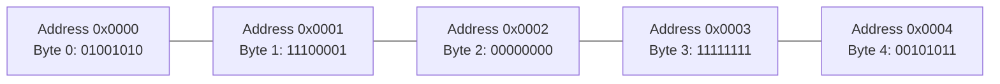
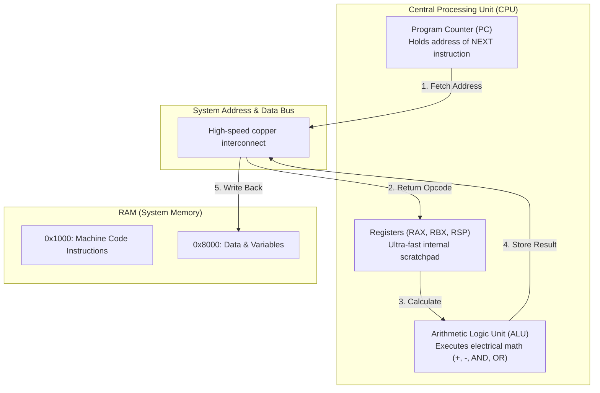

To understand where a Python object lives, we first have to strip away all software abstractions and look at the bare metal: **the CPU and RAM**.

---

## 1. RAM: The Street of Numbered Mailboxes

Imagine a single street that stretches for miles. On one side of the street are billions of tiny mailboxes, numbered sequentially from `0` to `17,179,869,183` (for a 16 GB RAM computer):

Each mailbox holds exactly **8 bits (1 Byte)**.

- A byte can store any integer from `0` to `255` (or an ASCII character).
- The number painted on the outside of the mailbox is its **Memory Address**.

### What is a Pointer?

A **pointer** is simply a memory address. It is nothing more than the number of a mailbox.

If data is stored at mailbox `0x10a4b0`, then any variable holding the number `0x10a4b0` is a "pointer" to that data. That's it. There is no magic to pointers.

---

## 2. 32-Bit vs. 64-Bit: How Long is an Address?

You often hear that modern operating systems and Python are **64-bit**. What does that mean?

- In a **32-bit CPU**, memory addresses are 32 bits long (4 bytes). The CPU can address up to 2^32 bytes (~4 GB) of RAM.
- In a **64-bit CPU**, memory addresses are 64 bits long (8 bytes). The CPU can address up to 2^64 bytes (~16 Exabytes).

> **Why this matters for Python:**  
> On your 64-bit Mac or Linux laptop, every pointer in CPython takes up **8 bytes**. When you create a variable or a list of 1,000 items, Python is allocating arrays of 8-byte addresses.

---

## 3. The CPU: The Fast Calculator

The Central Processing Unit (CPU) doesn't understand Python, English, or mathematics. It understands a tiny set of primitive operations wired into silicon:

### The Fetch-Decode-Execute Cycle

1. **Fetch**: Read the byte at the address pointed to by the Program Counter.
2. **Decode**: What does this instruction mean? (e.g. `0x48 0x01 0xD8` means `ADD RAX, RBX`).
3. **Execute**: Perform the electrical arithmetic and advance the Program Counter.

The CPU runs this loop **billions of times per second**.

---

## 4. Why We Need Abstractions

Machine code (raw bytes fed to a CPU) is:

- **Painful to write**: You must manually juggle CPU registers.
- **Hardware-locked**: Code for an Intel x86 chip will not run on an Apple Silicon ARM chip.
- **Dangerous**: Writing to the wrong memory address crashes the entire operating system.

High-level programming languages exist to let humans express logic without micromanaging electrical registers. But under all the syntax, **the hardware still only knows addresses and bytes**.

Next, let's see what happens when the operating system gives a running program its own sandbox: **[The Anatomy of a Running Process](/foundations/process-stack-and-heap/)**.
