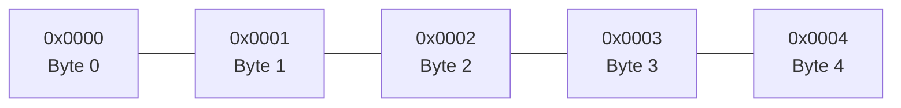
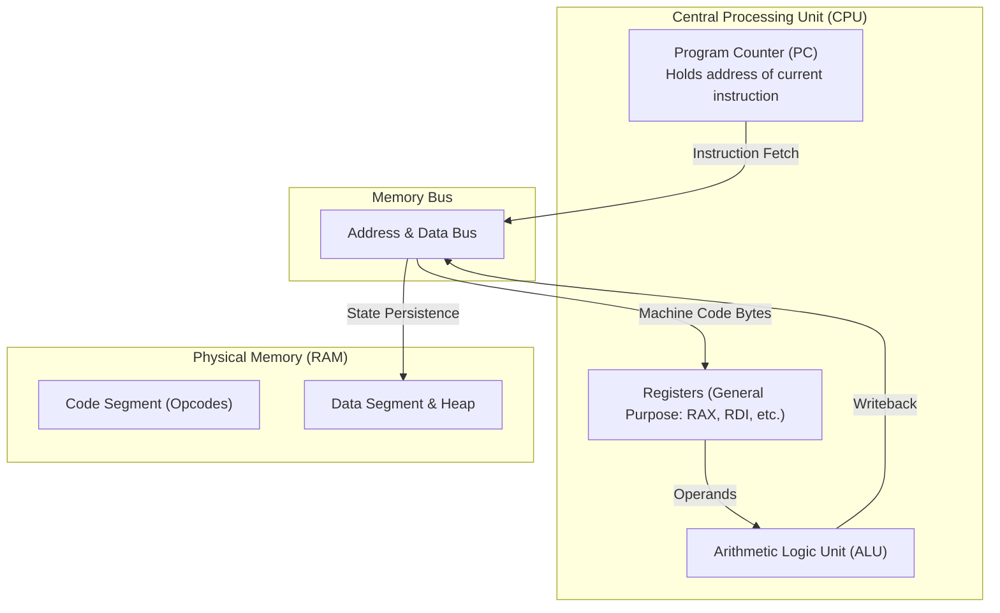

Before examining runtime abstractions, it is necessary to establish the physical constraints imposed by the underlying hardware architecture: the Central Processing Unit (CPU) and Random Access Memory (RAM).

---

## 1. Linear Memory Addressing

Physical memory is organized as a contiguous, one-dimensional array of 8-bit storage units (bytes). Each byte is assigned a unique numerical index designated as its **memory address**.



A byte can represent values in the range `[0, 255]`. Values requiring greater precision (such as 32-bit integers or 64-bit pointers) are composed of multiple contiguous bytes stored in accordance with the host architecture's endianness (typically little-endian on x86-64 and ARM64).

### Pointers Defined

A **pointer** is a numerical value that corresponds to a specific memory address. In a compiled language like C, declaring a pointer allocates storage capable of holding a memory address:

```c
uint64_t val = 42;
uint64_t* ptr = &val;  // 'ptr' stores the numerical memory address of 'val'
```

---

## 2. Address Bus Width and Word Size

The architecture of modern systems is defined primarily by its word size and address bus width:

| Architecture               | Address Bus Width                     | Pointer Size | Addressable Virtual Address Space |
| :------------------------- | :------------------------------------ | :----------- | :-------------------------------- |
| **32-bit (x86, ARM32)**    | 32 bits                               | 4 bytes      | 2^32 bytes (~4 GiB)               |
| **64-bit (x86-64, ARM64)** | 64 bits (typically 48-57 bits active) | 8 bytes      | 2^64 bytes (~16 EiB)              |

### Memory Overhead in 64-bit Systems

Because pointers in a 64-bit environment occupy **8 bytes**, pointer-dense runtimes like CPython incur measurable memory overhead:

- Every object reference (such as each element of a list, or each attribute lookup) involves dereferencing an 8-byte address.
- Arrays of pointers scale at 8 bytes per slot, excluding container metadata.

---

## 3. CPU Execution Pipeline

The CPU operates as an automated state machine executing machine instructions retrieved from memory.



### The Instruction Cycle

1. **Instruction Fetch**: The CPU retrieves the instruction byte sequence from the address designated by the Program Counter (PC).
2. **Instruction Decode**: The instruction decoder resolves the opcode and operand identifiers.
3. **Execute**: The Arithmetic Logic Unit (ALU) or control unit executes the operation, updating register state and advancing the Program Counter.

Higher-level runtimes like CPython do not bypass this cycle; rather, CPython is itself an executable compiled into machine instructions that the CPU processes according to these hardware rules.

Next: **[Process Address Space: Stack vs. Heap](/foundations/process-stack-and-heap/)**.
