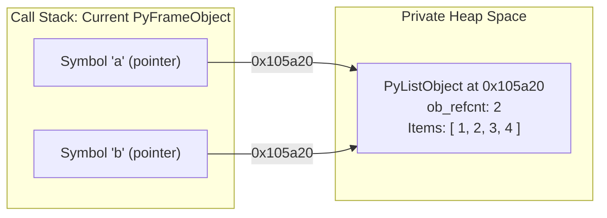
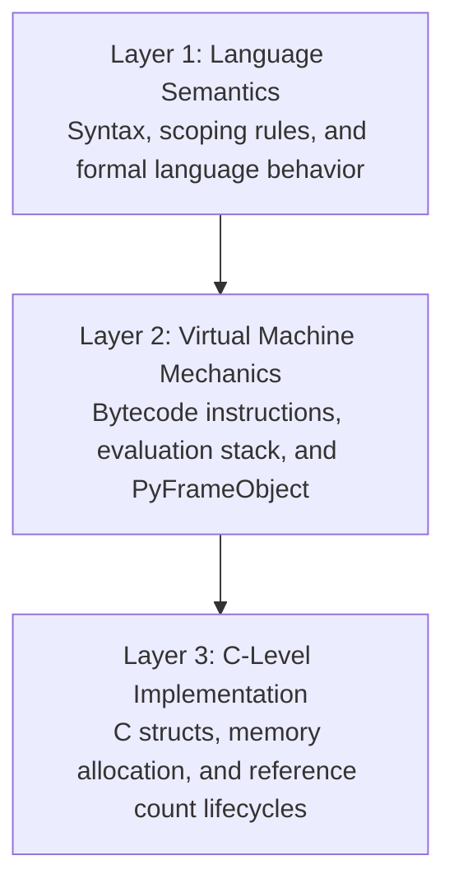

Introductory programming curricula frequently teach Python using the "box model" of variable assignment: a variable is described as a storage container that physically holds a value.

While this mental model functions reasonably well for statically typed languages with primitive types allocated directly on the call stack (such as C or Fortran), it breaks down completely in Python.

---

## The Container Fallacy

Consider a standard aliasing scenario:

```python
a = [1, 2, 3]
b = a
b.append(4)

print(a)  # Output: [1, 2, 3, 4]
```

Under the container model, a developer expects `a` to retain its initial state of `[1, 2, 3]`, reasoning that `b = a` creates an independent copy or assigns the value into a separate container.

When `a` reflects the mutation performed via `b`, developers unfamiliar with CPython's memory architecture are forced to memorize a set of ad-hoc rules regarding which types mutate in place and which do not.

---

## Name Binding: Variables as Pointers

In Python, variables are not storage locations. They are **symbolic names bound to memory addresses**.



When evaluating the statements:

1. `a = [1, 2, 3]`: The interpreter allocates a `PyListObject` on the heap at memory address `0x105a20`. The name `'a'` is entered into the local frame's symbol table with a pointer to `0x105a20`.
2. `b = a`: The interpreter reads the pointer stored in `'a'` (`0x105a20`) and binds the name `'b'` to the identical address. The object's reference counter (`ob_refcnt`) increments from 1 to 2.
3. `b.append(4)`: The interpreter dereferences `'b'`, locates the struct at `0x105a20`, and modifies its internal item array in place.
4. `print(a)`: Dereferencing `'a'` reads the struct at `0x105a20`, which now contains the fourth element.

### Three Axioms of Python's Memory Model

1. **Values have types; names do not.**  
   Type descriptors (`ob_type`) belong exclusively to objects residing on the heap. A variable name is merely an entry in a hash table or fast array.
2. **Assignment binds names to addresses.**  
   The assignment operator (`=`) never copies object data. It writes an object's memory address into a target symbol slot.
3. **Every Python variable is a C pointer.**  
   In the CPython implementation, all user-facing variables are internally represented as `PyObject*`.

---

## Identity vs. Equality

This architecture dictates the distinction between the `is` operator and the `==` operator:

| Operator     | Evaluation Mechanism  | CPython Implementation                                                                              |
| :----------- | :-------------------- | :-------------------------------------------------------------------------------------------------- |
| **`a == b`** | **Value Equality**    | Calls `type(a)->tp_richcompare(a, b, Py_EQ)`. Compares structural contents.                         |
| **`a is b`** | **Identity Equality** | Evaluates pointer comparison: `(a == b)`. Verifies if both names hold the identical memory address. |

```python
x = [1, 2, 3]
y = [1, 2, 3]

print(x == y)  # True: Both lists contain identical elements
print(x is y)  # False: Distinct heap allocations (distinct memory addresses)
```

---

## The Three Layers of Representation

Throughout this documentation, concepts are explored through three distinct lenses:



Understanding all three layers eliminates ambiguity, allowing developers to anticipate performance implications, memory overhead, and scoping behavior systematically.
