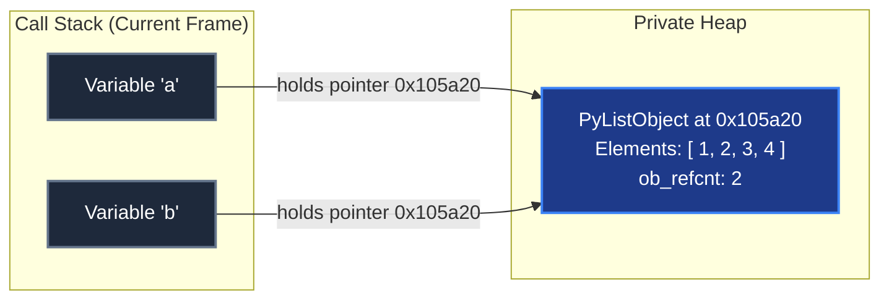
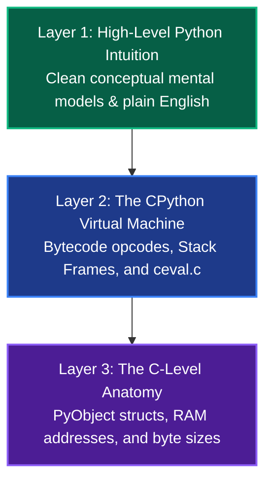

import { Card, CardGrid, Aside } from "@astrojs/starlight/components";

Most tutorials and introductory courses teach Python by showing you **what to type**, but completely hand-wave **what happens when you press Enter**.

You are told:

- _"A variable is a box that holds a value."_ 📦
- _"Python is friendly because it doesn't have pointers."_ 🙈
- _"Objects are passed by assignment (or by magic)."_ 🪄

Then you write code like this, and everything blows up:

```python
a = [1, 2, 3]
b = a
b.append(4)

print(a) # Output: [1, 2, 3, 4] -- Wait, why did 'a' change?!
```

If `a` was a box containing `[1, 2, 3]`, and you assigned `b = a`, a beginner naturally assumes `b` got a copy of the box. But mutating `b` mutated `a`.

To truly master Python—so you can read complex codebases, write idiomatic code, and debug insidious issues without guessing—you need **Mechanical Empathy**.

---

## What is Mechanical Empathy?

The term comes from legendary Formula 1 driver Jackie Stewart:

> _"You don't have to be an engineer to be a racing driver, but you do have to have mechanical empathy. You must understand what the gearbox, the clutch, and the engine are doing so you can work with them instead of against them."_

In software:

- **You don't have to rewrite CPython in C** to be a great Python engineer.
- But you **must understand where the bytes live, how the evaluation loop runs, and what a pointer is**, so Python stops feeling like unpredictable magic.

---

## The Core Shift: Boxes vs. Sticky Notes

Here is the single most important conceptual leap in Python:

<CardGrid>
  <Card title="The False Mental Model (Boxes)" icon="warning">
    **"A variable is a container."** You put the number `5` inside a box labeled `x`. When you do `y
    = x`, you create another box `y` and put `5` inside it.
  </Card>
  <Card title="The Real Mental Model (Sticky Notes)" icon="approve-check">
    **"A variable is a pointer (a label)."** The value `5` lives in the computer's memory warehouse
    (the heap). `x` is just a sticky note with an arrow pointing to that address. `y = x` just
    attaches a second sticky note to the exact same object.
  </Card>
</CardGrid>

### Visualizing the Truth

When you execute `a = [1, 2, 3]` followed by `b = a`, here is what CPython actually builds in your computer's memory:



When you call `b.append(4)`, you follow the pointer stored in `b` to the heap struct at address `0x105a20` and mutate it in-place. Because `a` points to that exact same address, printing `a` shows the updated list!

In Python:

1. **Values have types, variables do not.**
2. **Values live on the Heap; variable names live in Stack Frame dictionaries (`f_locals`).**
3. **Every single variable in Python is a pointer (`PyObject*`).**

---

## The 3-Tier Layer of Detail (LOD)

Throughout Cthru-Python, every concept is presented across three progressive depths:



You can read the docs at Layer 1 to build your intuition, and peel back Layer 2 and Layer 3 as you level up your systems understanding.

---

## The Learning Journey

Before we write variables or create functions, we start at the true first principles:

1. **[The Physical Machine & RAM](/foundations/hardware-and-memory/)**: How computers store and address bytes.
2. **[Anatomy of a Running Process](/foundations/process-stack-and-heap/)**: How operating systems divide memory into Code, Stack, and Heap.
3. **[What Actually is Python?](/foundations/what-is-python/)**: Why Python is a spec, CPython is a C program, and bytecode is the bridge.
4. **[The Universal PyObject](/foundations/the-pyobject/)**: The secret 16-byte header that lives on every piece of data in Python.
