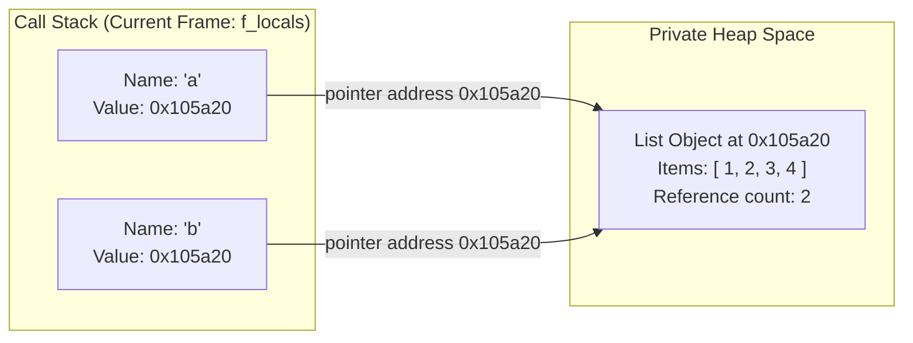

When someone begins learning Python, they are almost always told:

> _"A variable is like a box. When you write `x = 5`, you are putting the number 5 into a box labeled `x`."_

This box analogy is harmless for the first afternoon of coding. But as soon as you work with lists, dictionaries, or functions, the box analogy collapses and leads directly to bugs that can take days to diagnose.

This page explores Python's actual memory model across three progressive depths. You can read as deeply as you need for your current goals and move on when satisfied.

---

## Level 1: The Basics (Intuition & What Happens)

### The Mystery of the Mutating Variable

Open your terminal, launch `python3`, and test this snippet:

```python
a = [1, 2, 3]
b = a
b.append(4)

print(a)
```

If `a` were a box containing `[1, 2, 3]`, you would expect `print(a)` to output `[1, 2, 3]`. After all, you modified `b`, not `a`.

Instead, the terminal outputs:

```text
[1, 2, 3, 4]
```

### The Sticky Note Mental Model

Variables in Python are not boxes. **Variables are sticky notes (labels) attached to objects.**

```
Box Model (False):
┌───────────┐         ┌───────────┐
│  Box "a"  │         │  Box "b"  │
│ [1, 2, 3] │         │ [1, 2, 3] │
└───────────┘         └───────────┘

Sticky Note Model (True):
 [ Label "a" ] ───┐
                  ▼
 [ Label "b" ] ───▶ [ 1, 2, 3, 4 ]  (Single list object in memory)
```

1. When you write `a = [1, 2, 3]`, Python creates a single list object in memory, then attaches the label `"a"` to it.
2. When you write `b = a`, Python does **not** copy the list. It takes a second label, `"b"`, and attaches it to the **exact same list**.
3. When you call `b.append(4)`, you are modifying that shared object. Because `"a"` is stuck to that same object, looking at `a` reveals the new element.

### Try This in Your Terminal

You can verify whether two labels point to the exact same object using the `is` operator:

```python
a = [1, 2, 3]
b = a
print(a is b)  # True: Both labels point to the same object in memory

c = [1, 2, 3]
print(a == c)  # True: The contents are equal
print(a is c)  # False: These are two completely distinct lists in memory!
```

---

## Level 2: The Intermediate (Mechanics & The Virtual Machine)

Now let's look beneath the syntax at how the computer's memory is actually organized during execution.

### Stack Frames vs. The Private Heap

Every running Python program divides its memory into two main spaces:

1. **The Call Stack**: Fast, organized scratchpad holding active function frames.
2. **The Private Heap**: A vast open warehouse where every piece of data (numbers, strings, lists, functions) lives.



When you inspect a variable's `id()`, Python returns the actual memory address where that object lives on the heap:

```python
a = [1, 2, 3]
b = a
print(hex(id(a)))  # Example: 0x105a20
print(hex(id(b)))  # Example: 0x105a20 (Identical address!)
```

### The "Impossible" Tuple Mutation Puzzle

Consider this famous Python puzzle. What happens here?

```python
t = (1, 2, [3, 4])
t[2].append(5)
```

Does this fail because tuples are immutable? **No, it succeeds.**
`t[2]` accesses the third element of the tuple—which is an 8-byte pointer to a list on the heap. The tuple's pointer didn't change; only the list at the other end of the pointer changed!

Now consider this line:

```python
t[2] += [6]
```

If you run this, Python does something that shocks almost every intermediate developer:

1. It raises a `TypeError: 'tuple' object does not support item assignment`.
2. **Yet `6` is still added to the list!**

```python
print(t)
# Output: (1, 2, [3, 4, 5, 6])
```

#### Why?

In bytecode, `+=` on a list executes two steps:

1. It calls the in-place addition method (`list.extend`), which mutates the list on the heap.
2. It then attempts to assign the resulting pointer back to `t[2]`. The tuple rejects the assignment and raises `TypeError`, but the in-place mutation has already succeeded!

---

## Level 3: The Advanced (CPython C Internals)

For engineers who want the full systems picture, let's examine how CPython implements these structures in C.

### Variables in C: Arrays of Pointers

In CPython, a local variable is not a dynamic dictionary lookup at runtime. Inside a compiled function, local variables are indexed as raw C pointer arrays in the frame struct:

```c
// Conceptual representation from CPython's Include/cpython/frameobject.h
struct _interpreter_frame {
    PyCodeObject *f_code;         /* Bytecode to execute */
    struct _interpreter_frame *previous;
    PyObject *localsplus[1];      /* Array of local variable pointers (PyObject*) */
};
```

When you write `b = a`, the CPython evaluation loop (`Python/ceval.c`) executes:

```c
// Bytecode: LOAD_FAST 0 (a), STORE_FAST 1 (b)
PyObject *val = frame->localsplus[0];  /* Read pointer from slot 0 */
Py_INCREF(val);                        /* Increment reference count */
frame->localsplus[1] = val;            /* Write pointer into slot 1 */
```

### The Default Mutable Argument Trap Explained in C

Why does this classic bug happen?

```python
def append_item(element, target=[]):
    target.append(element)
    return target

print(append_item(1))  # [1]
print(append_item(2))  # [1, 2] -- Why did 1 stay in the list?!
```

In CPython, function definitions are executable statements:

1. When Python encounters `def append_item(...)`, it evaluates the default arguments **once**, at definition time.
2. It allocates `[]` on the heap and attaches that pointer to the function object's internal C struct: `func->func_defaults`.
3. Every time `append_item()` is called without a second argument, the new frame's `localsplus` slot is pointed directly to `func->func_defaults[0]`.

Because the default list is an allocated heap struct owned by the function definition itself, modifying it persists across all subsequent function calls.

```c
// From CPython's Objects/funcobject.c
PyObject *
PyFunction_NewWithQualName(PyObject *code, PyObject *globals, PyObject *qualname) {
    PyFunctionObject *op = PyObject_GC_New(PyFunctionObject, &PyFunction_Type);
    op->func_defaults = NULL;  /* Holds default argument tuple on heap */
    ...
    return (PyObject *)op;
}
```

---

## Summary of Key Takeaways

| Level                      | Key Takeaway                                                                                                                      |
| :------------------------- | :-------------------------------------------------------------------------------------------------------------------------------- |
| **Level 1 (Basics)**       | Variables are labels attached to objects, not boxes holding values. `b = a` shares the object.                                    |
| **Level 2 (Intermediate)** | Objects live on the Heap; variable names live in Stack frames as pointer addresses.                                               |
| **Level 3 (Advanced)**     | In CPython, local variables are fast `PyObject*` array slots; default arguments are stored on the function struct in heap memory. |

Next: **[Hardware Architecture & Memory Addressing](/foundations/hardware-and-memory/)**.
