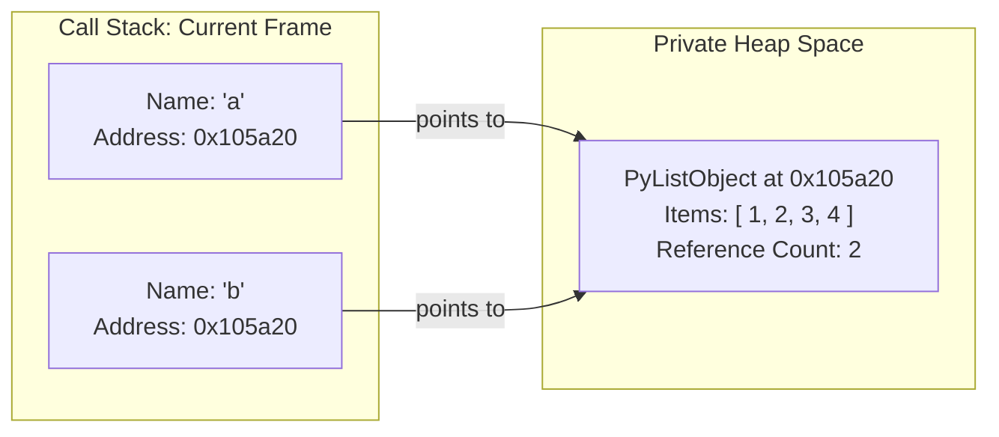

Most programming tutorials introduce variables using the box metaphor:

> _"A variable is like a labeled box. When you write `x = 5`, you are putting the number 5 inside the box named `x`."_

This analogy is harmless on day one. But as soon as you work with lists, functions, or mutable state, the box model breaks down and produces bugs that leave developers baffled.

Consider this standard snippet:

```python
a = [1, 2, 3]
b = a
b.append(4)

print(a)
```

If `a` and `b` were independent boxes containing list values, mutating `b` could never affect `a`. You would expect `print(a)` to output `[1, 2, 3]`.

Instead, the terminal outputs `[1, 2, 3, 4]`.

To write Python with confidence, we need to replace the box analogy with Python's real execution model: **name binding**.

---

## Variables Are Names, Not Boxes

In Python, variables are not storage containers. **Variables are names bound to objects living in memory.**

Think of variables as sticky notes attached to objects:

```text
The Box Model (False):
┌───────────┐         ┌───────────┐
│  Box "a"  │         │  Box "b"  │
│ [1, 2, 3] │         │ [1, 2, 3] │
└───────────┘         └───────────┘

The Name Binding Model (Actual):
 [ Label "a" ] ───┐
                  ▼
 [ Label "b" ] ───▶ [ 1, 2, 3, 4 ]  (Single list object on the heap)
```

When Python evaluates `a = [1, 2, 3]`:

1. It allocates a new list object containing references to `1`, `2`, and `3` on the private heap.
2. It binds the name `"a"` to that list object.

When Python evaluates `b = a`, it does **not** copy the list. The assignment operator (`=`) never copies objects in Python—it only binds names. Python takes a new name, `"b"`, and binds it to the exact same list object in memory.

When you call `b.append(4)`, you mutate the shared list in place. Because `"a"` remains bound to that same list, evaluating `a` naturally reflects the appended element.

Because names are separate from objects, Python provides two distinct operators to compare variables:

- `==` checks **value equality**: do two objects hold equivalent data?
- `is` checks **object identity**: do two names point to the exact same memory address?

```python
a = [1, 2, 3]
b = a
c = [1, 2, 3]

print(a == b)  # True: identical contents
print(a is b)  # True: both names point to the same object

print(a == c)  # True: identical contents
print(a is c)  # False: distinct list objects in memory
```

You can verify this directly in the REPL using the built-in `id()` function, which returns the object's virtual memory address in CPython:

```python
print(hex(id(a)))  # e.g., 0x105a20
print(hex(id(b)))  # 0x105a20 (same address as a)
print(hex(id(c)))  # 0x107b80 (a completely different address)
```

---

## The Memory Split: Stack Frames and the Heap

To understand why Python operates this way, we must look at how an operating system process organizes memory. A running Python program divides its memory space into two primary regions:

- **The Call Stack**: Fast, structured memory organized into stack frames (`PyFrameObject`). Each active function call receives a frame holding its local variable names.
- **The Private Heap**: Dynamic memory where all Python objects (integers, strings, lists, dictionaries, functions, and classes) are allocated.



In compiled languages like C or Rust, primitive values like `int x = 5` can live directly inside the CPU registers or stack frame.

In CPython, **all objects live on the heap**. Variables inside a stack frame are never values themselves—they are 8-byte pointer addresses referencing heap objects.

This separation between stack pointers and heap objects solves one of Python's most notorious edge-case puzzles:

```python
t = (1, 2, [3, 4])
t[2].append(5)
```

Tuples are immutable in Python. Does `t[2].append(5)` raise an exception?

No. It executes cleanly, and `t` becomes `(1, 2, [3, 4, 5])`.

The tuple `t` contains three 8-byte pointer addresses on the heap. Immutability means the tuple's array of pointer addresses cannot be reassigned. The third slot in `t` holds a pointer to a list at address `0x10f440`. That address never changed—only the list at `0x10f440` was mutated.

Now consider in-place augmented assignment:

```python
t = (1, 2, [3, 4])
t[2] += [5]
```

Run this in your terminal. You will get a puzzling result:

1. Python raises a `TypeError: 'tuple' object does not support item assignment`.
2. Yet if you inspect `t`, `5` **was still added to the list**: `(1, 2, [3, 4, 5])`.

Under the hood, `t[2] += [5]` executes two distinct bytecode steps:

1. **In-place extend**: Python calls the list's in-place add method (`list.__iadd__`), which extends the list object on the heap in place. This step succeeds.
2. **Reassignment**: The augmented assignment operator attempts to reassign the resulting object pointer back to `t[2]`. The tuple enforces immutability and raises `TypeError`.

The mutation already completed before the tuple rejected the assignment.

---

## How CPython Implements Name Binding

Underneath Python syntax, CPython is a C program. When beginners learn that variable names map to objects, they often assume CPython does a dictionary lookup for every variable access: `frame_dict["a"]`.

Hash table lookups for every variable read would make Python intolerably slow. Instead, the CPython compiler inspects your function source code before execution, counts the local variables, and converts their names into fixed integer offsets in a C array:

```c
// From CPython's Include/cpython/frameobject.h
struct _interpreter_frame {
    PyCodeObject *f_code;         /* Compiled bytecode */
    struct _interpreter_frame *previous;
    PyObject *localsplus[1];      /* Array of local variable pointers (PyObject*) */
};
```

When you write `b = a` inside a function, the evaluation loop (`Python/ceval.c`) executes two simple machine-level operations:

```c
// Bytecode: LOAD_FAST 0 (a), STORE_FAST 1 (b)
PyObject *val = frame->localsplus[0];  /* Read 8-byte pointer from slot 0 */
Py_INCREF(val);                        /* Increment reference count */
frame->localsplus[1] = val;            /* Write 8-byte pointer to slot 1 */
```

Variable assignment inside a function is literally copying an 8-byte memory address from one slot of a C array to another.

This pointer copying mechanism directly explains another classic Python pitfall:

```python
def append_item(element, target=[]):
    target.append(element)
    return target

print(append_item(1))  # [1]
print(append_item(2))  # [1, 2] -- Why did 1 persist?
```

Why did `1` persist in the default list across separate function calls?

In CPython, a `def` statement is an **executable statement**, not a static declaration:

1. When the Python interpreter evaluates `def append_item(...)`, it evaluates the default arguments **once**, at definition time.
2. It allocates the empty list `[]` on the heap and attaches that pointer to the function object's internal C struct: `func->func_defaults`.
3. Every time `append_item()` is called without a second argument, CPython points the new frame's `localsplus` slot directly to `func->func_defaults[0]`.

Because the default list is a heap-allocated struct owned by the function definition itself, in-place modifications to `target` mutate the single list stored in `func->func_defaults`.

---

Understanding that variables are symbolic names bound to heap pointers unlocks the rest of Python's architecture. Next, we will inspect how the physical machine and operating system manage the memory addresses where these objects live.
