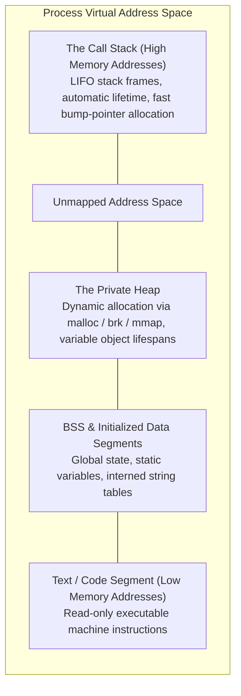
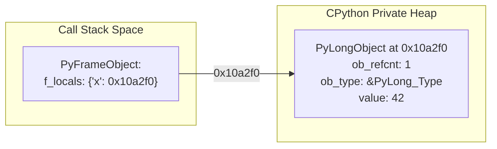

When an operating system initializes an executable, it instantiates a **Process** and assigns it an isolated virtual memory address space. Understanding how this space is segmented is foundational to understanding runtime behavior.

---

## 1. Virtual Address Space Segmentation

A 64-bit user-space process is structured into standardized functional segments:



---

## 2. Allocation Characteristics: Stack vs. Heap

The operating system provides two primary mechanisms for managing working memory during execution:

| Characteristic           | The Call Stack                                  | The Heap                                                      |
| :----------------------- | :---------------------------------------------- | :------------------------------------------------------------ |
| **Allocation Pattern**   | Contiguous LIFO (Last-In, First-Out)            | Arbitrary dynamic allocation and deallocation                 |
| **Allocation Mechanism** | Stack pointer register decrement (`sub rsp, N`) | Memory allocator traversal (`malloc`, `pymalloc`, free lists) |
| **Performance**          | O(1) allocation and deallocation                | O(1) to O(N) depending on fragmentation and allocator pools   |
| **Object Lifetime**      | Strictly bounded by function scope              | Explicitly managed; persists across scopes until freed        |
| **Size Constraint**      | Fixed limit (commonly 8 MiB on macOS/Linux)     | Bounded only by available virtual memory and swap             |

---

## 3. CPython's Memory Architecture

In compiled systems languages such as C, C++, and Rust, primitive variables are allocated directly within the call stack's active frame:

```c
// C example:
void compute(void) {
    int x = 42;  // 4 bytes allocated directly on the call stack
} // 'x' deallocated immediately upon function return
```

### The CPython Paradigm Shift

CPython diverges fundamentally from this model:

**In CPython, all Python data objects reside exclusively on the Private Heap.**

```python
x = 42
```

When this statement is evaluated:

1. CPython's small-object allocator allocates a `PyLongObject` struct within the **Heap**.
2. Within the active **Stack Frame** (`PyFrameObject`), a local variable slot stores the 8-byte **pointer address** to that heap struct.



Because variables store references rather than inline data:

- Rebinding a variable (`x = "text"`) replaces an 8-byte pointer; it does not overwrite a fixed memory slot.
- Function calls pass copies of pointer values (yielding "pass-by-assignment" semantics).
- Memory reclamation requires automated tracking mechanisms (Reference Counting and Generational Garbage Collection).

Next: **[The CPython Runtime Architecture](/foundations/what-is-python/)**.
