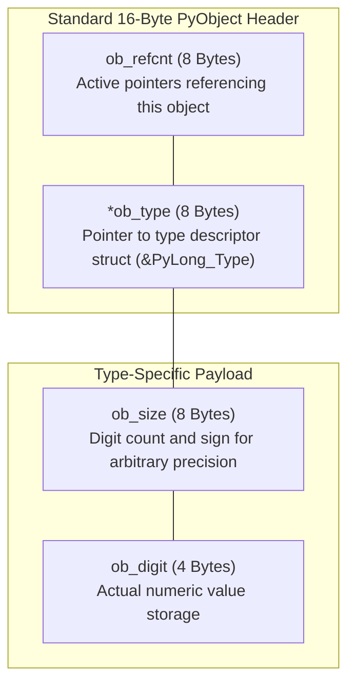
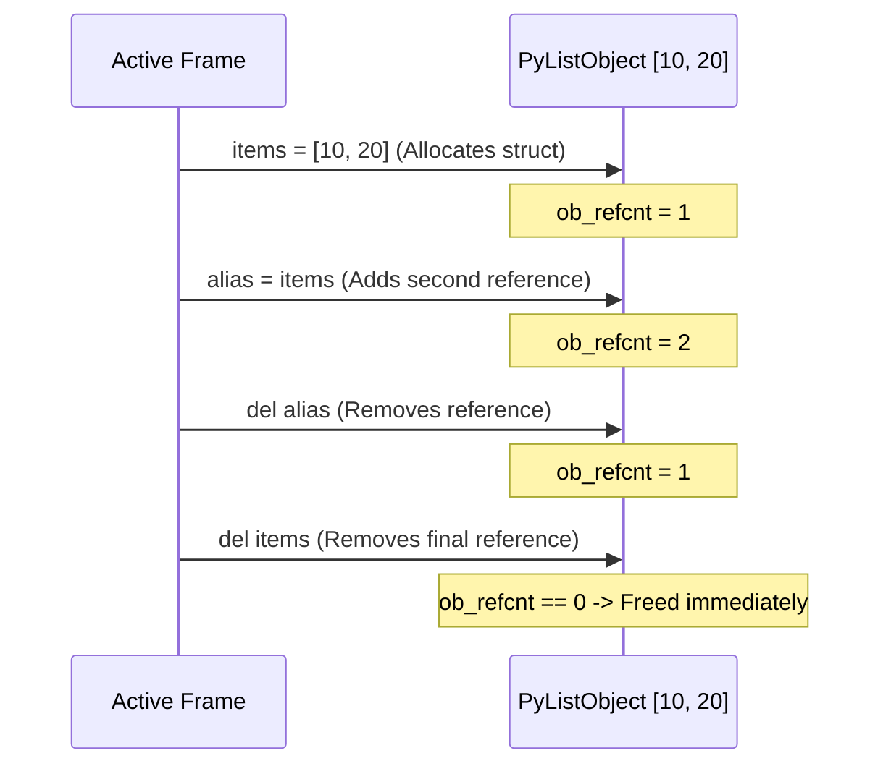
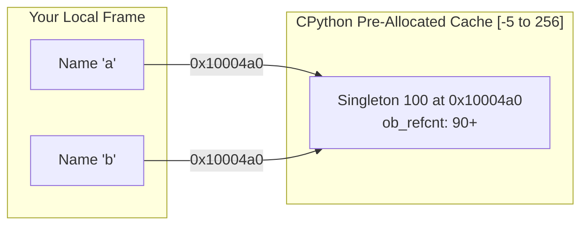

If you open Python in your terminal and ask how much memory the number `0` consumes, you get an unexpected answer:

```python
import sys
print(sys.getsizeof(0))
```

The terminal prints:

```text
28
```

In lower-level languages like C or Rust, an integer takes **4 bytes** (or 8 bytes for a 64-bit integer). Why does the number zero in Python consume **28 bytes** of RAM?

Understanding where those 28 bytes go reveals the universal architectural foundation of Python: the **`PyObject`**.

---

## Why a Python Integer Consumes 28 Bytes

In lower-level systems, a number is just a raw sequence of bits stored in memory. The CPU has no idea whether those bits represent a signed integer, an ASCII character, or a memory address unless the compiler hardcodes it ahead of time.

In Python, every piece of data carries its own identity badge:

```text
Raw C Integer (4 Bytes):
┌───────────────────────────┐
│        Value: 42          │
└───────────────────────────┘

Python Integer (28 Bytes):
┌───────────────────────────┬───────────────────────────┐
│  Who is pointing to me?   │   What type of data am I? │
│   (Reference Count: 8B)   │     (Type Pointer: 8B)    │
├───────────────────────────┼───────────────────────────┤
│    How big is my value?   │     Actual value digits   │
│       (Digit Count: 8B)   │         (Value: 4B)       │
└───────────────────────────┴───────────────────────────┘
```

Because every piece of data carries this structural metadata, Python can:

- **Manage memory automatically**: Objects clean themselves up when nothing references them.
- **Support dynamic typing**: The runtime can verify at any instant whether an object is a number, a string, or a list.
- **Support arbitrary precision**: Python integers never overflow 64-bit limits—they dynamically allocate more 30-bit digit chunks as the number grows.

This overhead applies to all Python types:

```python
import sys

print("Empty string:", sys.getsizeof(""))  # ~49 bytes
print("Empty list:",   sys.getsizeof([]))  # ~56 bytes
print("Empty dict:",   sys.getsizeof({}))  # ~64 bytes
```

Every single object on the Python heap carries structural metadata to support the runtime's dynamic capabilities.

---

## The Universal 16-Byte Header and Reference Counting

Every single object living on CPython's heap begins with the exact same 16-byte structural header:

- **`ob_refcnt` (8 bytes)**: The reference counter tracking how many active pointers point to this object.
- **`ob_type` (8 bytes)**: An 8-byte pointer referencing the type descriptor struct (such as `&PyLong_Type` or `&PyList_Type`).



Because Python doesn't require manual `malloc()` and `free()` calls, it relies on reference counting to reclaim memory automatically:

- Every time you assign an object to a variable or add it to a list, its `ob_refcnt` increments by 1.
- Every time a variable falls out of scope or is deleted with `del`, its `ob_refcnt` decrements by 1.
- When `ob_refcnt` reaches zero, the memory is immediately released.



You can inspect an object's reference count directly using `sys.getrefcount()`:

```python
import sys

x = [1, 2, 3]
print(sys.getrefcount(x) - 1)  # 1

y = x
print(sys.getrefcount(x) - 1)  # 2

del y
print(sys.getrefcount(x) - 1)  # 1
```

_(Note: `sys.getrefcount(x)` temporarily creates one extra reference during the call, so we subtract 1 to see the true count)._

---

## Memory Optimizations: Structs, Raw RAM, and Singletons

In CPython's C source code ([`Include/object.h`](https://github.com/python/cpython/blob/main/Include/object.h)), the foundational struct is defined as:

```c
struct _object {
    uintptr_t ob_refcnt;
    struct _typeobject *ob_type;
};

typedef struct _object PyObject;
```

For variable-length objects (lists, strings, tuples, and large integers), `PyVarObject` adds length metadata:

```c
struct _varobject {
    PyObject ob_base;
    Py_ssize_t ob_size; /* Number of items in variable part */
};

typedef struct _varobject PyVarObject;
```

Because `id()` returns the literal memory address of the C struct, we can use Python's `ctypes` library to read the raw memory bytes directly from RAM:

```python
import ctypes

num = 42
addr = id(num)

# Read the 28 raw bytes directly from RAM:
raw_memory = ctypes.string_at(addr, 28)
print("Address:", hex(addr))
print("Raw Bytes:", list(raw_memory))
```

On a 64-bit machine:

- Bytes `0..7`: The 64-bit integer representing `ob_refcnt`.
- Bytes `8..15`: The 64-bit memory address pointing to the `PyLong_Type` type struct.
- Bytes `16..23`: The `ob_size` field indicating the number of 30-bit digit chunks.
- Bytes `24..27`: The raw digit value `42`.

Because allocating 28 bytes for every small number would be slow, CPython includes a built-in optimization: the **Small Integer Cache**.

At startup, CPython pre-allocates singletons for all integers between **`-5` and `256`** in [`Objects/longobject.c`](https://github.com/python/cpython/blob/main/Objects/longobject.c):



You can test this caching behavior in your terminal:

```python
# Within the cached range [-5 to 256]:
a = 100
b = 100
print(a is b)          # True: Both point to the exact same shared singleton!
print(id(a) == id(b))  # True: Identical memory addresses

# Outside the cached range:
x = 1000
y = 1000
print(x is y)          # False: Two separate 28-byte structs on the heap!
print(id(x) == id(y))  # False: Distinct memory addresses
```

When an integer within `[-5, 256]` is requested, CPython increments the reference count of the pre-allocated array element and returns that pointer directly, bypassing heap allocation entirely.
