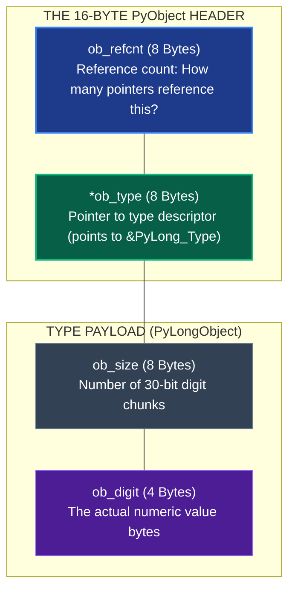
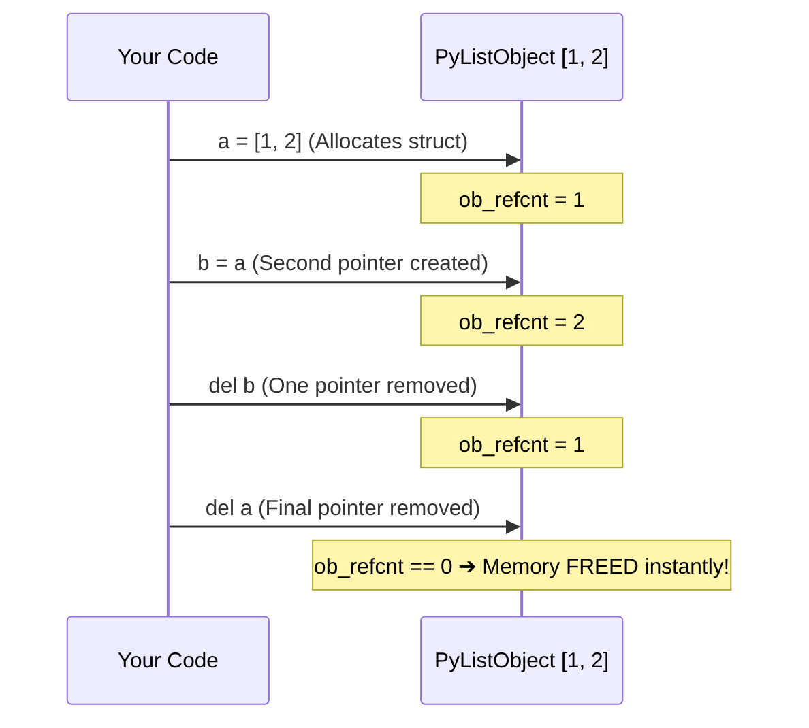
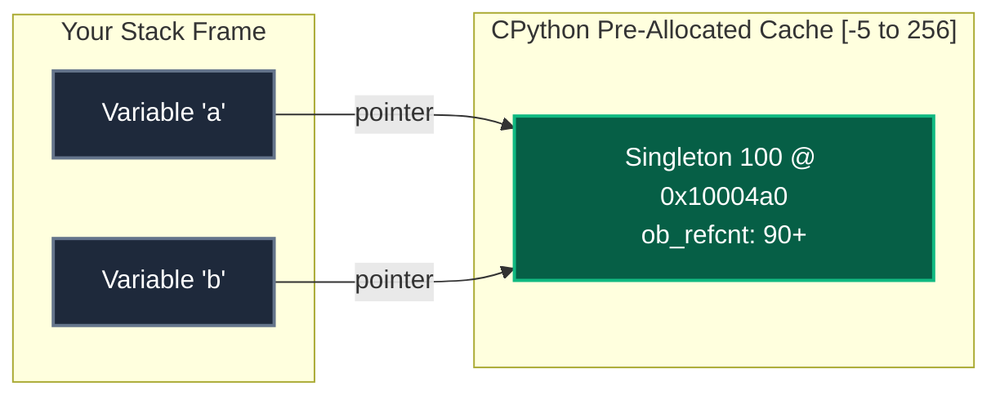

import { Aside } from "@astrojs/starlight/components";

Open your terminal, launch `python3`, and run this:

```python
import sys
sys.getsizeof(0)
# Output: 28 (or 24 on some platforms)
```

In C, an integer takes **4 bytes**.  
Why does the number `0` in Python swallow **28 bytes** of RAM?

Because in CPython, there is no such thing as a bare number. Everything you ever touch—numbers, strings, functions, even the `None` object—is wrapped inside a C struct called **`PyObject`**.

---

## 1. The 16-Byte Tax

Every single object living on CPython's private heap starts with the exact same 16-byte header:

```c
// Directly from CPython source: Include/object.h
struct _object {
    uintptr_t ob_refcnt;          // 8 bytes: Who is pointing to me?
    struct _typeobject *ob_type;  // 8 bytes: What type of object am I?
};
```



When you add it up:

- **`ob_refcnt` (8 bytes)**: Reference counter. Hits zero ➔ memory is freed instantly.
- **`ob_type` (8 bytes)**: Pointer to the type struct. This is how Python knows at runtime that this object is an `int` and has methods like `to_bytes()`.
- **`ob_size` (8 bytes)**: Python integers have arbitrary precision (they never overflow 64-bit limits). This stores the chunk count.
- **Value digits (4 bytes)**: The actual raw number.
  _Total: 8 + 8 + 8 + 4 = 28 bytes._

---

## 2. Reading Raw RAM with `ctypes`

Want proof that this isn't just an abstract theory? You can peek at the raw memory bytes of any Python object right from your terminal using Python's `ctypes` module:

```python
import ctypes

x = 42

# 1. Get the actual C memory address:
addr = id(x)
print(f"Memory Address: {hex(addr)}")

# 2. Read 28 raw bytes directly from that RAM address:
raw_memory = ctypes.string_at(addr, 28)
print("Raw Bytes in RAM:", list(raw_memory))
```

You are looking at the literal silicon memory layout of a Python integer in your machine's physical memory.

---

## 3. How Memory is Cleaned Up: `sys.getrefcount()`

Because Python doesn't have a C-style `free()` function, it tracks pointers automatically:



Try this in a REPL:

```python
import sys

# Create a list
a = [1, 2, 3]
print(sys.getrefcount(a) - 1)  # Output: 1

# Add an alias
b = a
print(sys.getrefcount(a) - 1)  # Output: 2

# Remove an alias
del b
print(sys.getrefcount(a) - 1)  # Output: 1
```

_(Note: `sys.getrefcount(a)` temporarily creates one extra reference to pass `a` into the function, so we subtract 1)._

---

## 4. The Small Integer Cache Trick

Allocating 28 bytes for every small calculation like `i += 1` would destroy performance.  
To avoid this, CPython pre-allocates singletons for numbers from **`-5` to `256`** at startup.



Try this:

```python
# Inside the cache:
a = 100
b = 100
a is b          # True! Both point to the same singleton struct.
id(a) == id(b)  # True! Same memory address.

# Outside the cache:
x = 1000
y = 1000
x is y          # False! Two distinct 28-byte structs on the heap.
id(x) == id(y)  # False! Different memory addresses.
```

When you understand that variables are pointers to `PyObject`s on the heap, oddities like `a is b` stop being trivia tricks—they become obvious consequences of CPython's memory management.
