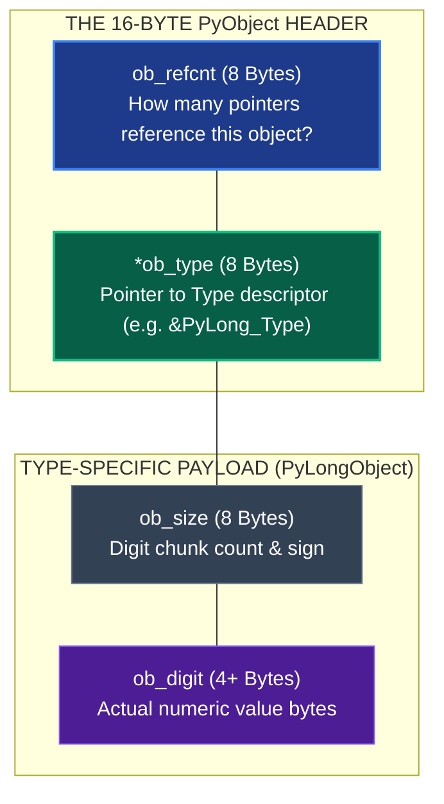
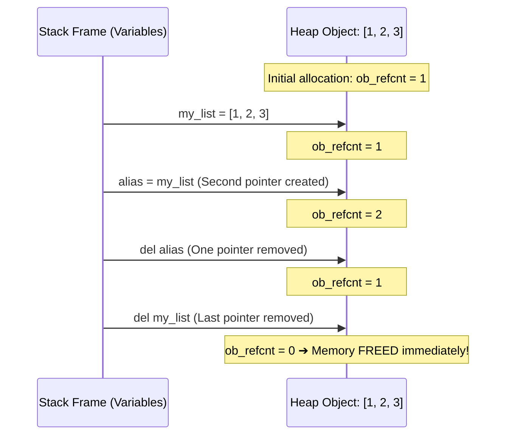

import { Aside } from "@astrojs/starlight/components";

Open a Python REPL and run this command:

```python
import sys
print(sys.getsizeof(0))
# Output: 24 or 28 bytes!
```

In the C language, the number `0` takes **4 bytes** (or 8 bytes for a 64-bit int).  
Why does the number `0` in Python consume **28 bytes** of RAM?

Because in Python, there are no "primitive types". There are only **`PyObject`s**.

---

## 1. The Anatomy of a `PyObject`

Every single piece of data allocated on Python's private heap starts with the exact same 16-byte header:

```c
// Directly from CPython's Include/object.h:
struct _object {
    uintptr_t ob_refcnt;          // 8 bytes: Reference count
    struct _typeobject *ob_type;  // 8 bytes: Pointer to Type descriptor
};
```



Let's break down the 28 bytes of an integer:

1. **`ob_refcnt` (8 bytes)**: Tracks how many pointers currently reference this object. When this hits zero, CPython immediately frees the memory.
2. **`ob_type` (8 bytes)**: A pointer to the type object (`PyLong_Type`). This is how Python knows that this object is an integer and what methods it supports.
3. **`ob_size` (8 bytes)**: Python integers have arbitrary precision (they never overflow 64-bit limits). `ob_size` stores the number of digit chunks.
4. **Value payload (4 bytes)**: The actual numeric representation.
   _Total = 8 + 8 + 8 + 4 = 28 bytes!_

---

## 2. Proving It: Real C Memory Addresses with `id()`

Python has a built-in function called `id()`.

According to the official Python documentation:

> _"Return the 'identity' of an object. This is guaranteed to be unique and constant for this object during its lifetime. **In CPython, this is the address of the object in memory.**"_

Run this in Python:

```python
x = 1000
print(hex(id(x)))
# Example output: 0x104b2a8d0
```

`0x104b2a8d0` is not an ID number generated by a database. It is the **actual hexadecimal memory address of that `PyObject` struct in your computer's RAM**.

---

## 3. Reference Counting: `sys.getrefcount()`

Because Python allocates everything on the Heap, it needs a way to know when to delete an object.

It uses **Reference Counting**:

- Every time a variable points to an object, its `ob_refcnt` increases by 1.
- Every time a variable is deleted (`del x`) or falls out of scope, its `ob_refcnt` decreases by 1.
- When `ob_refcnt == 0`, CPython immediately reclaims that memory block.



```python
import sys

# Create a new list object
my_list = [1, 2, 3]

# Check its reference count:
print(sys.getrefcount(my_list) - 1) # Output: 1

# Create a second variable pointing to the same list:
alias = my_list
print(sys.getrefcount(my_list) - 1) # Output: 2!

# Delete one variable:
del alias
print(sys.getrefcount(my_list) - 1) # Output: 1!
```

---

## 4. The CPython Singleton Optimization

Because allocating 28 bytes for every small integer would be slow, CPython includes a built-in optimization called the **Small Integer Cache**:

During startup, CPython pre-allocates a single array of `PyLongObject` singletons for all integers from **`-5` to `256`**.

```mermaid
flowchart LR
    subgraph Stack["Stack Frame (Variables)"]
        varA["Variable 'a'"]
        varB["Variable 'b'"]
    end

    subgraph Cache["Small Integer Cache [-5 to 256]"]
        singleton["Singleton PyLongObject(100)<br/>Memory Address: 0x10004a0<br/>ob_refcnt: 94+"]
    end

    varA -->|id(a) = 0x10004a0| singleton
    varB -->|id(b) = 0x10004a0| singleton

    style singleton fill:#065f46,stroke:#10b981,stroke-width:2px,color:#fff
    style varA fill:#1e293b,stroke:#64748b,stroke-width:2px,color:#fff
    style varB fill:#1e293b,stroke:#64748b,stroke-width:2px,color:#fff
```

Test this in your terminal:

```python
# Inside the cache [-5 to 256]:
a = 100
b = 100
print(a is b)        # True! (Both point to the EXACT same memory address!)
print(id(a) == id(b)) # True!

# Outside the cache:
x = 1000
y = 1000
print(x is y)        # False! (Two separate objects on the heap)
print(id(x) == id(y)) # False!
```

When you understand that variables are pointers to `PyObject`s on the heap, oddities like `a is b` stop being trivia tricks—they become obvious consequences of CPython's memory management!
