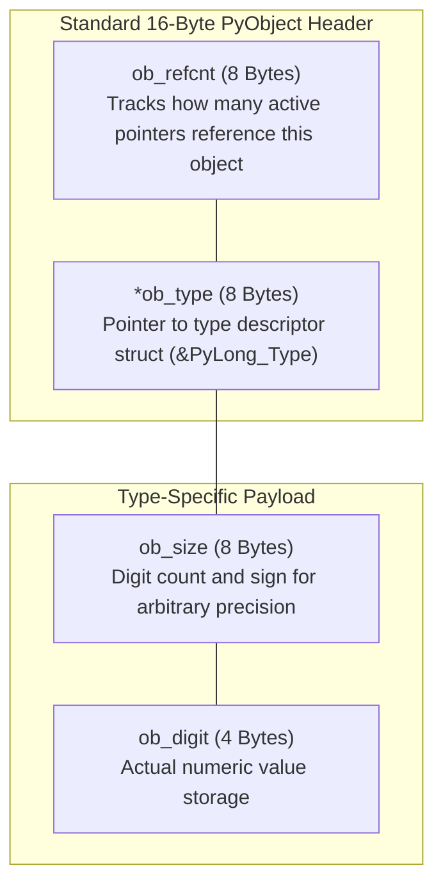
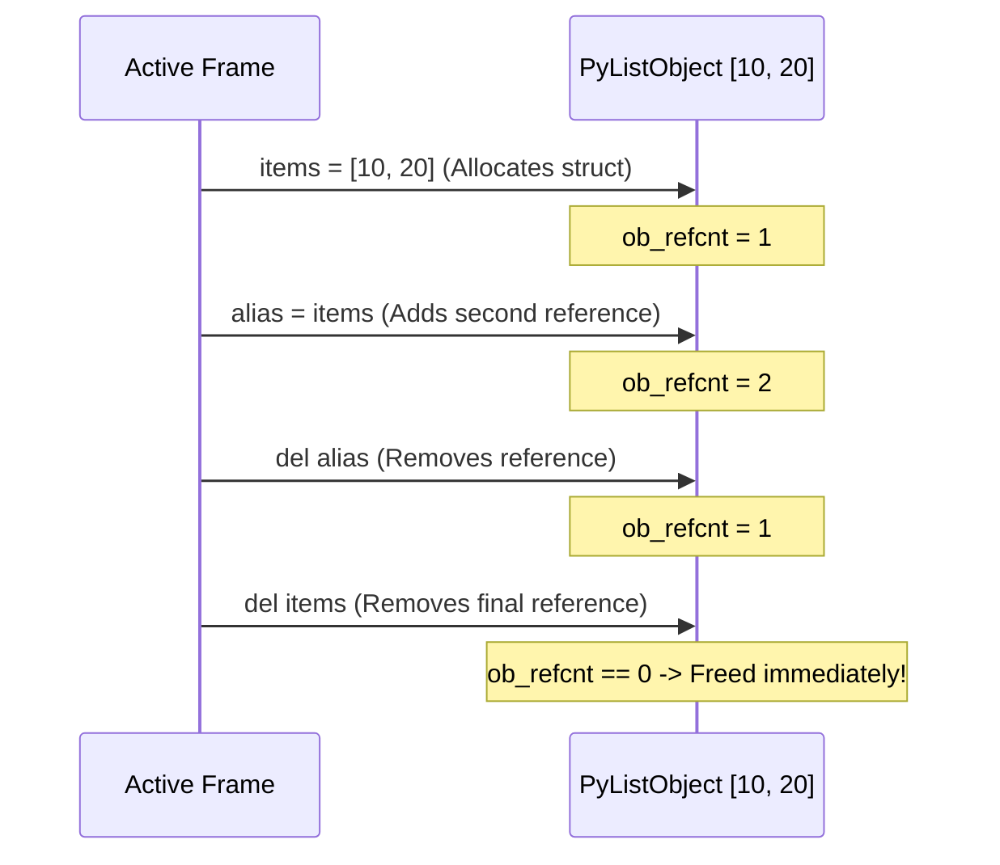
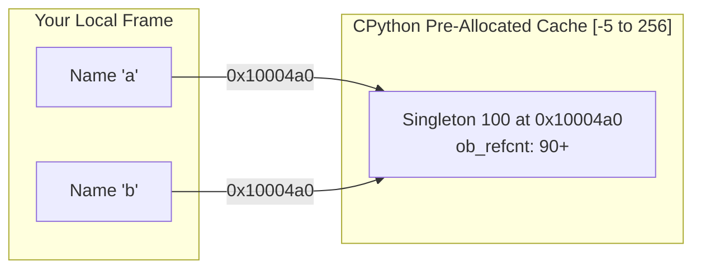

If you open Python in your terminal and ask how much memory the number `0` consumes, you get an unexpected answer:

```python
import sys
print(sys.getsizeof(0))
```

The terminal prints:

```text
28
```

In languages like C or Rust, an integer takes **4 bytes** (or 8 bytes for a 64-bit integer). Why does the number zero in Python consume **28 bytes** of RAM?

This page breaks down how Python represents data in memory, structured into three progressive depths.

---

## Level 1: The Basics (Intuition & What Happens)

### The Identity Badge Metaphor

In lower-level languages, a number is just a raw sequence of bits stored in memory. The computer has no idea whether those bits represent a number, a character, or part of an image unless the compiler hardcodes it ahead of time.

Python is different. In Python, **data carries its own identity badge**:

```
Raw C Integer (4 Bytes):
┌───────────────────────────┐
│        Value: 42          │
└───────────────────────────┘

Python Integer (28 Bytes):
┌───────────────────────────┬───────────────────────────┐
│  Who is pointing to me?   │   What type of data am I? │
│   (Reference Count: 8B)   │     (Type Pointer: 8B)    │
├───────────────────────────┼───────────────────────────┤
│    How big is my value?   │     Actual value digits   │
│       (Digit Count: 8B)   │         (Value: 4B)       │
└───────────────────────────┴───────────────────────────┘
```

Because every piece of data carries this metadata, Python can:

- Automatically manage memory (cleaning up an object when nothing points to it).
- Support dynamic typing (knowing at runtime whether an object is a number, string, or list).
- Support infinite-precision numbers (Python integers never overflow 64-bit limits).

### Try This in Your Terminal

Check the memory overhead of different basic types in your Python REPL:

```python
import sys

print("Empty string:", sys.getsizeof(""))        # ~49 bytes!
print("Empty list:",   sys.getsizeof([]))        # ~56 bytes!
print("Empty dict:",   sys.getsizeof({}))        # ~64 bytes!
```

Every single object carries structural overhead to support Python's dynamic runtime features.

---

## Level 2: The Intermediate (Mechanics & The Virtual Machine)

Now let's examine how CPython uses this metadata during program execution.

### The 16-Byte Header

Every object living on CPython's heap begins with the exact same 16-byte structural header:

1. **`ob_refcnt` (8 bytes)**: The reference counter.
2. **`ob_type` (8 bytes)**: A pointer pointing to the type descriptor struct (such as `PyLong_Type` or `PyList_Type`).



### Deterministic Reference Counting

Because Python doesn't require manual `malloc()` and `free()` calls, it relies on reference counting to reclaim memory automatically:

- Every time you assign an object to a variable or add it to a list, its `ob_refcnt` increments by 1.
- Every time a variable falls out of scope or is deleted with `del`, its `ob_refcnt` decrements by 1.
- When `ob_refcnt` reaches zero, the memory is immediately released.



You can inspect an object's reference count directly using `sys.getrefcount()`:

```python
import sys

x = [1, 2, 3]
print(sys.getrefcount(x) - 1)  # 1

y = x
print(sys.getrefcount(x) - 1)  # 2

del y
print(sys.getrefcount(x) - 1)  # 1
```

_(Note: `sys.getrefcount(x)` temporarily creates one extra reference during the function call, so we subtract 1 to see the true count)._

### The Small Integer Cache Puzzle

Because allocating 28 bytes for every small number would be slow, CPython includes a built-in optimization called the **Small Integer Cache**:

At startup, CPython pre-allocates singletons for all integers between **`-5` and `256`**.



Test this behavior in your terminal:

```python
# Within the cached range [-5 to 256]:
a = 100
b = 100
print(a is b)        # True: Both point to the exact same shared singleton!
print(id(a) == id(b)) # True: Identical memory addresses

# Outside the cached range:
x = 1000
y = 1000
print(x is y)        # False: Two separate 28-byte structs on the heap!
print(id(x) == id(y)) # False: Distinct memory addresses
```

---

## Level 3: The Advanced (CPython C Internals)

For systems engineers, here is how `PyObject` is defined and manipulated in CPython's C source code.

### The C Struct Definition

In [`Include/object.h`](https://github.com/python/cpython/blob/main/Include/object.h), every Python object starts with `_object`:

```c
struct _object {
    uintptr_t ob_refcnt;
    struct _typeobject *ob_type;
};

typedef struct _object PyObject;
```

For variable-length objects (lists, strings, tuples, and large integers), `PyVarObject` adds length metadata:

```c
struct _varobject {
    PyObject ob_base;
    Py_ssize_t ob_size; /* Number of items in variable part */
};

typedef struct _varobject PyVarObject;
```

### Inspecting Raw C Struct Memory with `ctypes`

Because `id()` returns the literal memory address of the C struct, we can use Python's `ctypes` library to read the raw memory bytes directly:

```python
import ctypes

num = 42
addr = id(num)

# Read the 28 raw bytes directly from RAM:
raw_memory = ctypes.string_at(addr, 28)
print("Address:", hex(addr))
print("Raw Bytes:", list(raw_memory))
```

On a 64-bit machine:

- Bytes `0..7`: The 64-bit integer representing `ob_refcnt`.
- Bytes `8..15`: The 64-bit memory address pointing to the `PyLong_Type` type struct.
- Bytes `16..23`: The `ob_size` field indicating the number of 30-bit digit chunks.
- Bytes `24..27`: The raw digit value `42`.

### The C Source Implementation of Small Int Caching

The small integer pre-allocation logic is located in [`Objects/longobject.c`](https://github.com/python/cpython/blob/main/Objects/longobject.c):

```c
#define _PY_NSMALLPOSINTS 257
#define _PY_NSMALLNEGINTS 5

static PyLongObject small_ints[_PY_NSMALLNEGINTS + _PY_NSMALLPOSINTS];

PyObject *
_PyLong_GetSmallInt_AsRef(int ival)
{
    assert(-_PY_NSMALLNEGINTS <= ival && ival < _PY_NSMALLPOSINTS);
    PyObject *v = (PyObject *)&small_ints[ival + _PY_NSMALLNEGINTS];
    Py_INCREF(v);
    return v;
}
```

When an integer is created, CPython checks if `ival >= -5 && ival < 257`. If so, it increments the reference count of the pre-allocated array element and returns that pointer directly, bypassing memory allocation entirely.

---

## Summary of Key Takeaways

| Level                      | Key Takeaway                                                                                                       |
| :------------------------- | :----------------------------------------------------------------------------------------------------------------- |
| **Level 1 (Basics)**       | Numbers in Python are wrapped in an "identity badge" carrying type, count, and size metadata.                      |
| **Level 2 (Intermediate)** | The 16-byte header enables automatic reference counting; small ints `[-5, 256]` are cached singletons.             |
| **Level 3 (Advanced)**     | In C, `PyObject` is defined as `ob_refcnt` + `*ob_type`; integers use 30-bit digit arrays for arbitrary precision. |

Next: **[Process Address Space: Stack vs. Heap](/foundations/process-stack-and-heap/)**.
