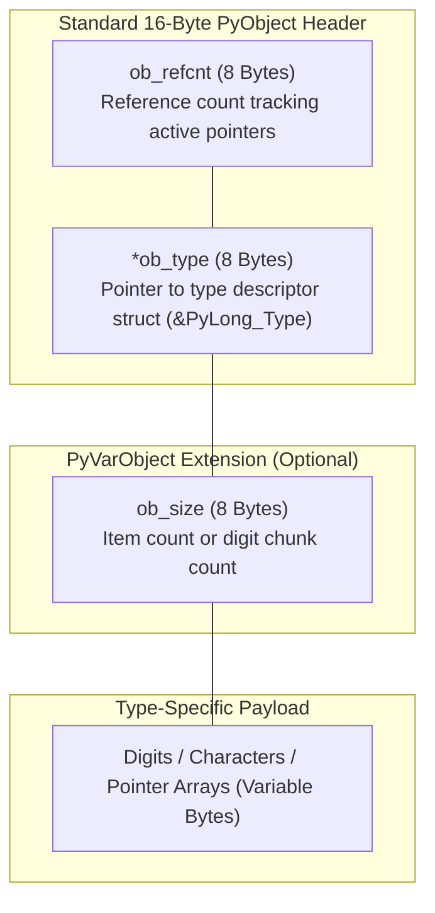
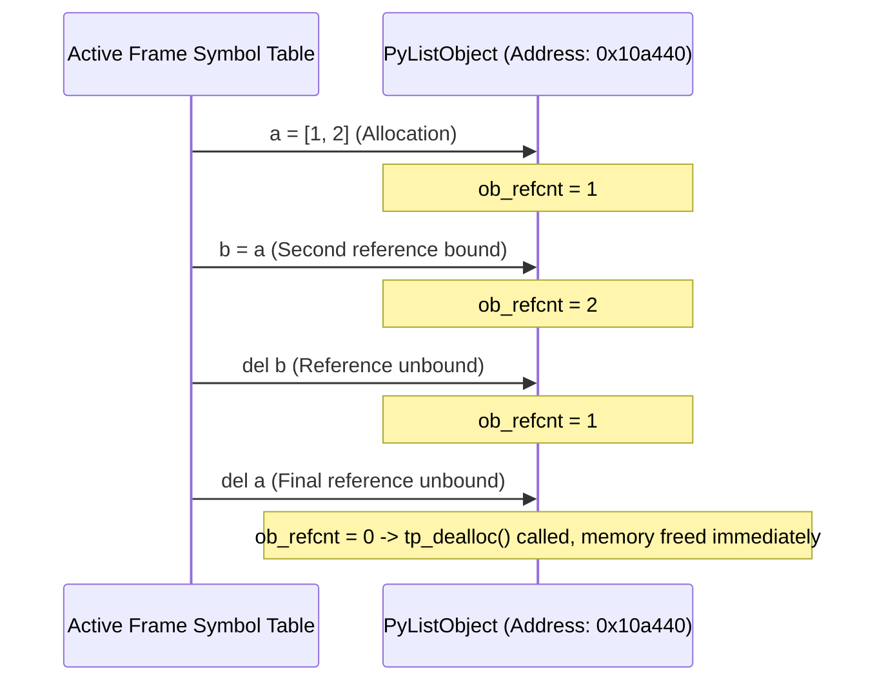
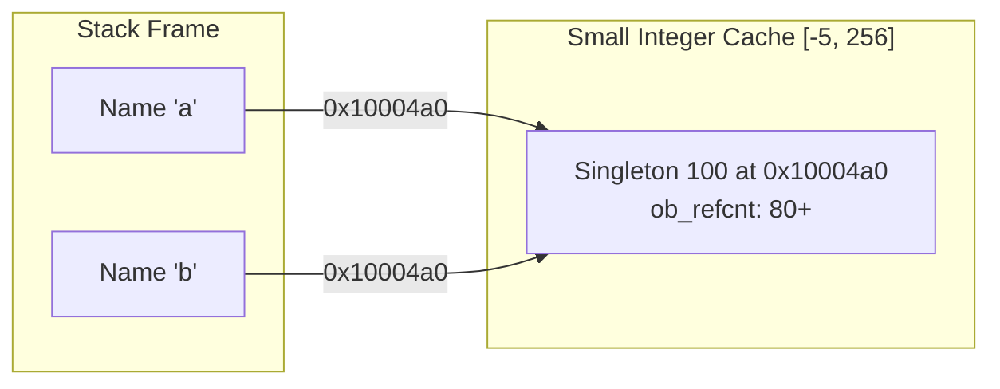

In compiled languages like C, a 64-bit integer resides directly in an 8-byte register or memory slot. In CPython, primitive values do not exist in isolation. Every entity instantiated within the runtime is represented by an allocated C struct conforming to the **`PyObject`** interface.

---

## 1. Struct Definition: The 16-Byte Header

Every object residing within CPython's heap begins with the structural fields defined by `PyObject_HEAD`:

```c
// CPython definition from Include/object.h
struct _object {
    uintptr_t ob_refcnt;          // 8 bytes: Reference counter
    struct _typeobject *ob_type;  // 8 bytes: Pointer to Type object
};

typedef struct _object PyObject;
```

For variable-length containers and arbitrarily sized numbers, `PyVarObject` extends this header with length metadata:

```c
struct _varobject {
    PyObject ob_base;             // 16 bytes: Inherited PyObject header
    Py_ssize_t ob_size;           // 8 bytes: Item count or digit count
};

typedef struct _varobject PyVarObject;
```



---

## 2. Memory Footprint Analysis: The 28-Byte Integer

Evaluating `sys.getsizeof(0)` in a standard 64-bit CPython environment yields `28` bytes:

```python
import sys
print(sys.getsizeof(0))  # Output: 28 bytes
```

The memory layout of a `PyLongObject` accounts for this footprint:

| Struct Member        | Type            | Size         | Purpose                                                                     |
| :------------------- | :-------------- | :----------- | :-------------------------------------------------------------------------- |
| `ob_refcnt`          | `uintptr_t`     | 8 bytes      | Number of active references pointing to this object.                        |
| `*ob_type`           | `PyTypeObject*` | 8 bytes      | Pointer to `PyLong_Type`, defining integer methods and behavior.            |
| `ob_size`            | `Py_ssize_t`    | 8 bytes      | Number of digit units used by CPython's arbitrary-precision integer engine. |
| `ob_digit[1]`        | `uint32_t`      | 4 bytes      | Allocated array element for integer value representation.                   |
| **Total Allocation** |                 | **28 bytes** | _(Minimum footprint for an integer on 64-bit systems)_                      |

---

## 3. Direct Memory Inspection via `ctypes`

Because `id()` returns the literal virtual memory address of the underlying C struct, CPython's `ctypes` foreign-function interface allows direct inspection of heap memory:

```python
import ctypes

val = 42
addr = id(val)

# Retrieve raw memory representation from the struct address
raw_bytes = ctypes.string_at(addr, 28)
print("Address:", hex(addr))
print("Raw struct bytes:", list(raw_bytes))
```

The leading bytes represent the `ob_refcnt` counter and the 64-bit pointer pointing to the static `PyLong_Type` struct in CPython's data segment.

---

## 4. Deterministic Reference Counting

CPython relies primarily on reference counting for memory management:

- Every binding operation increments an object's `ob_refcnt`.
- Every unbinding or scope departure decrements `ob_refcnt`.
- When `ob_refcnt` reaches zero, the object's deallocator (`tp_dealloc`) is executed immediately, releasing the memory block to CPython's internal allocator (`pymalloc`).



```python
import sys

ref_test = [10, 20, 30]
# sys.getrefcount temporarily increments count during evaluation
print(sys.getrefcount(ref_test) - 1)  # 1

alias = ref_test
print(sys.getrefcount(ref_test) - 1)  # 2

del alias
print(sys.getrefcount(ref_test) - 1)  # 1
```

---

## 5. Pre-Allocation Optimization: Small Integer Cache

To mitigate the allocation overhead of small integer arithmetic, CPython pre-allocates a static array of `PyLongObject` instances during runtime initialization covering the range **`[-5, 256]`** (defined by `_PY_NSMALLNEGINTS` and `_PY_NSMALLPOSINTS` in `Objects/longobject.c`).



Because integer values within this range resolve to static singletons:

```python
# Within cache range: Resolves to identical singleton address
a = 100
b = 100
print(a is b)        # True
print(id(a) == id(b)) # True

# Outside cache range: Allocates distinct heap structs
x = 1000
y = 1000
print(x is y)        # False
print(id(x) == id(y)) # False
```

Understanding `PyObject` layout and heap allocation clarifies why identity comparison (`is`) diverges from equality comparison (`==`) and demonstrates how runtime optimizations dictate memory behavior.
