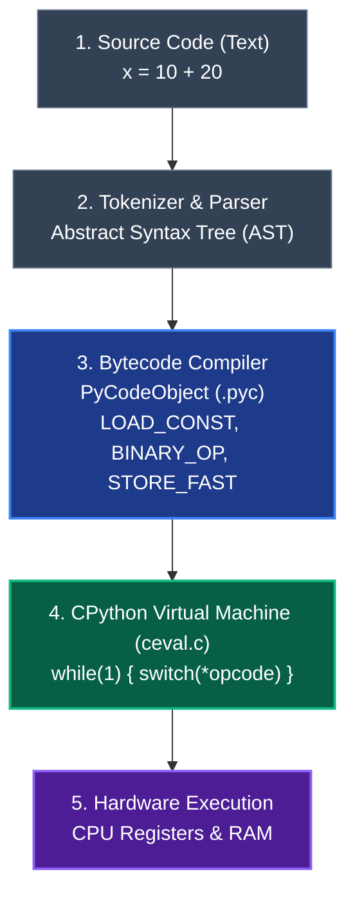

import { Aside } from "@astrojs/starlight/components";

When people say _"Python is slow"_ or _"Python is dynamically typed"_, what are they actually talking about?

There is an essential distinction that unlocks true understanding:
**Python is a specification; CPython is a program.**

---

## 1. Specification vs. Implementation

- **Python (The Language)**: A set of syntax rules and semantics defined by documentation and Python Enhancement Proposals (PEPs). It is an idea written on paper.
- **CPython (The Engine)**: The default, official implementation of Python. It is an open-source program written in the **C programming language**. When you type `python` in your terminal, you are launching an executable binary compiled from C source files.

_(There are other implementations: PyPy uses a Just-In-Time compiler; Jython runs on the Java JVM; MicroPython runs on microcontrollers. But 99% of the world uses CPython)._

---

## 2. The 4-Stage Journey of Your Code

When you run `python main.py`, your code does not get executed line-by-line as raw text. It goes through four distinct stages:



---

## 3. Bytecode: The Secret Bridge

Python is neither purely "compiled" like C/Rust, nor purely "interpreted" like early Bash scripts. **It is a bytecode-interpreted language.**

Bytecode is an intermediate, machine-independent set of instructions designed for an imaginary software CPU called the **Python Virtual Machine (PVM)**.

You can inspect Python's bytecode right now using the built-in `dis` (disassembler) module:

```python
import dis

def add_numbers():
    x = 10
    y = 20
    return x + y

dis.dis(add_numbers)
```

Output:

```text
  2           0 LOAD_CONST               1 (10)
              2 STORE_FAST               0 (x)

  3           4 LOAD_CONST               2 (20)
              6 STORE_FAST               1 (y)

  4           8 LOAD_FAST                0 (x)
             10 LOAD_FAST                1 (y)
             12 BINARY_OP                0 (+)
             14 RETURN_VALUE
```

Look closely at those instructions:

- `LOAD_CONST`: Pushes a constant object onto the evaluation value stack.
- `STORE_FAST`: Stores the top pointer from the stack into local variable slot `0` (`x`).
- `BINARY_OP`: Calls CPython's C addition routine on the two top objects.
- `RETURN_VALUE`: Pops the result and returns it to the caller.

---

## 4. The Virtual Machine Loop (`ceval.c`)

At the very heart of CPython is a single C file: [`Python/ceval.c`](https://github.com/python/cpython/blob/main/Python/ceval.c).

Inside it sits a giant C function containing an infinite loop and a `switch` statement:

```c
// Conceptual view of Python's main evaluation loop in C:
for (;;) {
    opcode = *next_instruction++;
    switch (opcode) {
        case LOAD_FAST:
            // Fetch pointer from local frame array
            PUSH(GETLOCAL(oparg));
            DISPATCH();

        case STORE_FAST:
            // Pop pointer and save to local frame array
            SETLOCAL(oparg, POP());
            DISPATCH();

        case BINARY_OP:
            // Pop two PyObjects and execute their C type's add method
            ...
    }
}
```

Every single time your Python program runs, a real compiled C program is stepping through these bytecode numbers, manipulating pointers on your computer's RAM.

Now that we know who is running the show, let's meet the most fundamental citizen in Python's universe: **[The Universal PyObject](/foundations/the-pyobject/)**.
