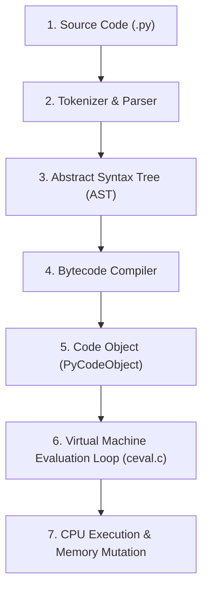

To understand CPython's execution behavior, one must distinguish between the Python language specification and its concrete implementation in C.

- **Python (The Specification)**: The language syntax and runtime semantics documented in the Python Language Reference and formal Python Enhancement Proposals (PEPs).
- **CPython (The Runtime)**: The reference implementation authored in C. CPython is an executable binary compiled from source files located in the `cpython` repository.

---

## 1. The Compilation and Execution Pipeline

CPython executes Python source code through a multi-phase translation pipeline:



### Phase 1: Lexical Analysis and Parsing

The tokenizer converts source text into a stream of lexical tokens. The parser constructs an Abstract Syntax Tree (AST) representing the syntactic structure of the program in accordance with Python's formal grammar.

### Phase 2: Bytecode Compilation

The compiler traverses the AST, resolves variable scopes using symbol tables, and generates instructions for an idealized stack machine: **Python Bytecode**. The resulting bytecode, along with metadata (constants, variable names, line number mappings), is packaged into a **`PyCodeObject`**.

---

## 2. Bytecode Inspection

Bytecode is a sequence of 2-byte instructions (in Python 3.11+, each instruction consists of a 1-byte opcode and a 1-byte argument).

The standard library `dis` module exposes this representation:

```python
import dis

def calculate(x, y):
    return x + y * 2

dis.dis(calculate)
```

Output:

```text
  2           0 RESUME                   0

  3           2 LOAD_FAST                0 (x)
              4 LOAD_FAST                1 (y)
              6 LOAD_CONST               1 (2)
              8 BINARY_OP                5 (*)
             12 BINARY_OP                0 (+)
             16 RETURN_VALUE
```

### Stack Machine Execution

Unlike register-based CPUs (such as x86-64), CPython's virtual machine is a **stack machine**:

1. `LOAD_FAST 0`: Pushes the pointer corresponding to parameter `x` onto the evaluation stack.
2. `LOAD_FAST 1`: Pushes the pointer corresponding to parameter `y` onto the evaluation stack.
3. `LOAD_CONST 1`: Pushes the pointer to integer constant `2` onto the evaluation stack.
4. `BINARY_OP 5 (*)`: Pops `2` and `y`, executes multiplication, and pushes the resulting `PyObject*` back onto the stack.
5. `BINARY_OP 0 (+)`: Pops the multiplication result and `x`, executes addition, and pushes the result.
6. `RETURN_VALUE`: Pops the top element and returns it to the caller's frame.

---

## 3. The Evaluation Loop: `ceval.c`

The execution engine resides in [`Python/ceval.c`](https://github.com/python/cpython/blob/main/Python/ceval.c) inside the core interpreter function `_PyEval_EvalFrameDefault()`.

In simplified terms, the interpreter loop operates as follows:

```c
// Simplified representation of _PyEval_EvalFrameDefault in Python/ceval.c
PyObject* _PyEval_EvalFrameDefault(PyThreadState *tstate, PyFrameObject *f, int throwflag) {
    _Py_CODEUNIT *first_instr = f->f_code->co_firstlineno;
    _Py_CODEUNIT *next_instr = first_instr;
    PyObject **stack_pointer = f->f_valuestack;

    for (;;) {
        _Py_CODEUNIT word = *next_instr++;
        int opcode = _Py_OPCODE(word);
        int oparg = _Py_OPARG(word);

        switch (opcode) {
            case LOAD_FAST: {
                PyObject *value = f->f_localsplus[oparg];
                Py_INCREF(value);
                *stack_pointer++ = value;
                DISPATCH();
            }
            case BINARY_OP: {
                PyObject *right = *--stack_pointer;
                PyObject *left = *--stack_pointer;
                PyObject *res = evaluate_binary_op(left, right, oparg);
                *stack_pointer++ = res;
                DISPATCH();
            }
            case RETURN_VALUE: {
                PyObject *retval = *--stack_pointer;
                return retval;
            }
        }
    }
}
```

Every Python construct maps directly to these C operations and macro dispatches.

Next: **[Object Model & Memory Layout (PyObject)](/foundations/the-pyobject/)**.
